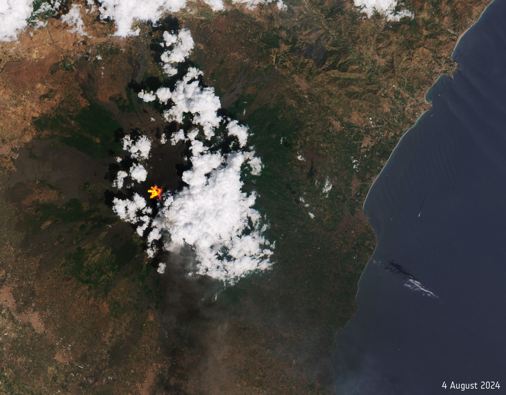

# Analysis of Mt. Etna's eruptions
This presentation is based on the latest Sicily's Mt. Etna's eruptions; it will show, especially, the differences recorded during two eruptions happened within a year of each other, in August 2024 and June 2025. Some of the parameters that will be analysed are the NDVI (Normal Difference Vegetation Index) and the difference in sulfur dioxide emission.
## Data gathering
All data are gathered from [Google Earth](https://earth.google.it), [Earth Observatory site](https://earthobservatory.nasa.gov/) and [Copernicus Data Space Ecosystem site](https://dataspace.copernicus.eu/explore-data/data-collections/sentinel-data/sentinel-2).

Used packages:

``` r
library(terra)      # for spatial data analysis
library(imageRy)    # to analyse raster images with R
library(viridis)    # useful for changing color ramp palette
library(patchwork)  # adds ggplot grphics together to compose multiplot layouts
library(ggplot2)    # creates data visualizations with grammar of graphics
```
Creating a function for flipping and plotting the images at the same time with one line code:

```r
flot <- function(x,y){
  x = rast(y)  # creates a variable that contains the image
  x = flip(x)  # flipping image
  plot(x)
  return(x)    # outputs the rotated image
}
```
Setting the working directory and importing data:

``` r
setwd("C:/Users/fsaiu/UNI/MAGISTRALE/TELERILEVAMENTO")
gview = flot(gview, "Italy.jpg")
```
This image shows Italy in a typical setting, without eruptions:


>The other images are downloaded with the same procedure as this one.

During the eruptions Mt. Etna looks like theese two images in true colors, respectively in 2024 and 2025:



All the images used for analisys are summarised  below, from top to bottom are shown false colors pictures from Sentinel-2, representation of sulfur dioxide plume in the atmosphere took from the Nasa site and lastly the images in false colors of the same plumes taken by Sentinel-5P:


## Data analisys 

### Difference Vegetation Index (DVI)
It is an index used in remote sensing to analyse the health of vegetation through satellite imeages. It is calculated from reflectance values in spectral bands, more specifically in Near InfraRed (NIR), invisible, and in the Red band, visible to the human eye. Healthy plants reflect a lot in NIR band and absorb a large amount of red light due to photosynthesis, meanwhile stressed vegetation reflects less NIR light and also reflects red one, because of its lack of chlorophyll, thanks to this behaviour it is possible to have direct information on vegetation health status. DVI is very simple to estimate and useful to derive the normalised index, NDVI, indipendent from light intensity and atmospheric conditions and included in a range between -1 and +1.
From true color images it is noticeable that between August 2024 and June 2025, vegetation seems to be restored, that's because they show two different moments of the year, respectively end of spring and end of summer. The false colors images, however, show the reflectance in NIR and red bands discussed earlier; with those it is possible to subtract NIR band layer with the red band layer obtaining the DVI range, like so:

``` r
# Calculating dvi for year 2024
dvi24 = fc24[[1]] - fc24[[2]] # NIR - red
# Calculating dvi for year 2025
dvi25 = fc25[[1]] - fc25[[2]] # NIR - red
```

Plotting them side to side it can be recognised the difference between spring and summer:


