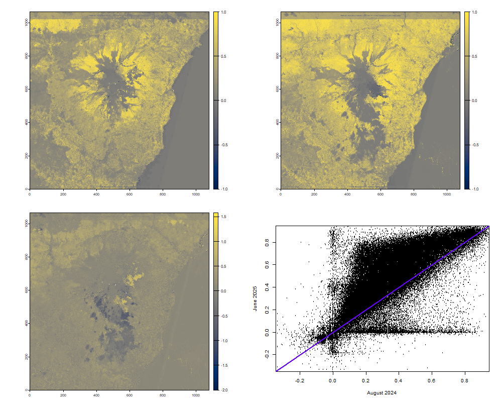

# Analysis of Mt. Etna's eruptions
This presentation is based on the latest Sicily's Mt. Etna's eruptions; it will show, especially, the differences recorded during two eruptions happened within almost a year of each other, in August 2024 and June 2025. Some of the parameters that will be analysed are the NDVI (Normal Difference Vegetation Index) and the difference in sulfur dioxide emission.
## Data gathering
All data are gathered from [Google Earth](https://earth.google.it), [Earth Observatory site](https://earthobservatory.nasa.gov/) and [Copernicus Data Space Ecosystem site](https://dataspace.copernicus.eu/explore-data/data-collections/sentinel-data/sentinel-2).

Used packages:

``` r
library(terra)      # for spatial data analysis
library(imageRy)    # to analyse raster images with R
library(viridis)    # useful for changing color ramp palette
library(patchwork)  # adds ggplot graphics together to compose multiplot layouts
library(ggplot2)    # creates data visualizations with grammar of graphics
```
Creating a function for flipping and plotting the images at the same time with one code line:

```r
flot <- function(x,y){
  x = rast(y)  # creates a variable that contains the image
  x = flip(x)  # flipping image
  plot(x)
  return(x)    # outputs the rotated image
}
```
Setting the working directory and importing data:

``` r
setwd("C:/Users/fsaiu/UNI/MAGISTRALE/TELERILEVAMENTO")
gview = flot(gview, "Italy.jpg")  # between brakets gview corresponds to x and "Italy.jpg" to y from the funtion
```
This image shows Italy in a typical setting, without eruptions:


>The other images are downloaded with the same procedure as this one.

During the eruptions Mt. Etna looks like these two images in true colors, respectively in 2024 and 2025:


All the images used for analisys are summarised  below, from top to bottom are shown false colors pictures from Sentinel-2, the images in false colors of sulfur dioxide plumes taken by Sentinel-5P and lastly representation of the same plumes in the atmosphere took from the Nasa site:


## Data output
To present a well done report it is crucial to create collages with the results obtained. All following outcome images are made by generating a png file:

``` r
png("images.png", width=1000, height=800)                   # width and height are used to resize the image
im.multiframe(3,2)
im.plotRGB(fc24, r=1, g=2, b=3, title="9 August 2024")
im.plotRGB(fc25, r=1, g=2, b=3, title="31 May 2025")
im.plotRGB(so2.24, r=1, g=2, b=3, title="4 August 2024")
im.plotRGB(so2.25, r=1, g=2, b=3, title="2 June 2025")
im.plotRGB(so2d24, r=1, g=2, b=3, title="4 August 2024")
im.plotRGB(so2d25, r=1, g=2, b=3, title="2 June 2025")
dev.off()
```

This script, for example, produced the last picture of the previous chapter.
> As before the other outputs are created with the same process.

## Data analisys 

### Difference Vegetation Index (DVI)
It is an index used in remote sensing to analyse the health of vegetation through satellite images. It is calculated from reflectance values in spectral bands, more specifically in Near InfraRed (NIR), invisible, and in the Red band, visible to the human eye. Healthy plants reflect a lot in NIR band and absorb a large amount of red light due to photosynthesis, meanwhile stressed vegetation reflects less NIR light and also reflects red one, because of its lack of chlorophyll, thanks to this behaviour it is possible to have direct information on vegetation health status. DVI is very simple to estimate and useful to derive the normalised index, NDVI, indipendent from light intensity and atmospheric conditions and included in a range between -1 and +1.


From true color images in chapter "Data gathering", it is noticeable that between August 2024 and June 2025, vegetation seems to be restored, that's because they show two different moments of the year, respectively end of summer and end of spring. The false colors images above, however, show the reflectance in NIR and red bands discussed earlier; with those it is possible to subtract red band layer to the NIR band layer obtaining the DVI range, like so:

``` r
# Calculating dvi for year 2024
dvi24 = fc24[[1]] - fc24[[2]] # NIR - red

# Calculating dvi for year 2025
dvi25 = fc25[[1]] - fc25[[2]] # NIR - red
```

Plotting them side to side it can be recognised the difference between summer and spring:


As told before it is observable that in the second image the lighter color is more dominant, confirming a denser and healthier vegetation typical of the spring time, in contrast with the first picture that mostly shows darker shades.

The estimation of Normal Difference Vegetation Index is the final aim, it assesses vegetation health by measuring the ratio between the difference of NIR and red (DVI) and their sum, using R coding:

``` r
# Calculating NDVI for year 2024
ndvi24 = dvi24 / (fc24[[1]] + fc24[[2]])

# Calculating NDVI for year 2025
ndvi25 = dvi25 / (fc25[[1]] + fc25[[2]])
```
Now, with these new variables, it is possible to calculate the difference between the two indices, visible in image number one, second row, here below. In colors close to yellow it is observable the positive outcome, which implicates a higher NDVI value and so the presence of new vegetation in a former dry area.

To analitically compare NDVI values between the two dates, results are plotted in a cartesian graph and it is added a bisector for reference, if the points lay on it the NDVI has not change within the time period. All values above the bisector indicate an improvement of vegetation wellness, all below instead show worsening conditions. In this case the majority of data is located upon the line and that means that the vegetation is more lush and dense than 2024, as per above.

The code will look like this:

``` r
# Calculating the difference between the two NDVI, 2025-2024
ndvidiff = ndvi25 - ndvi24

# Plotting the results
plot(ndvi24, ndvi25, xlim=c(-0.3,0.9), ylim=c(-0.3, 0.9), ylab="June 2025", xlab="August 2024")  # graph
abline(0, 1, col="#6600ff", lwd=2)                                                               # bisector
dev.off()
```

The output illustrates in the first row the results of NDVI calculation (respectively 2024 and 2025), in the second row the difference of those indices and the graphic extrapolated:



### Sulfur dioxide emisson
Assessing sulfur dioxide concentration is fundamental during, before and after an eruption. The main reasons are volcanic monitoring, environmental impact, effects on the climate and human health. In other words, this gas helps with predictions of new eruptions, but it is very dangerous when a volcano emits large quantities of it, in fact, it may react with the water in the atmosphere and generate sulfuric acid that contributes to acid rain, vegetation damage and soil contamination. Furthermore, these fumes can irritate eyes and mucous membranes and cause damage to the respiratory system, especially in people that already have pulmonary complications.


Using the set of photos above, which show sulfur dioxide emissions, the varying quantity of the product will be estimated by considering only one band, the first one. Taking a look at the images it is possible to see that the sulfur dioxide plume of year 2024 was spreading much more than this year's plume. That is because both plumes' spreading are affected by the presence or absence of the wind, indeed they do not follow the same path, meaning different settings on wind conditions.
The difference is calculated like this:

``` r
so2d = so2.25[[1]] - so2.24[[1]]
```

Then, the extent to which the values deviate from their average can be extrapolated using the latter variable:

``` r
sd = focal(so2d, w=c(3,3), fun="sd")            # standard deviation (sd) with 3x3 pixels moving window
sd24 = focal(so2.24[[1]], w=c(3,3), fun="sd")
sd25 = focal(so2.25[[1]], w=c(3,3), fun="sd")
```
This approach allows the determination of either the total standard deviation and those within the data from both years. From total standard deviation should be easy to evaluate the variance index, sum of the square deviations divided by the number of deviations or standard deviation to the second:

``` r
var = sd^2
```

Last thing to do is plotting ggplot graphics, for comparison:

``` r
# Changing names to distinguish the graphics
names(sd)="Total standard deviation"
names(sd24)="Standard deviation year 2024"
names(sd25)="Standard deviation year 2025"
names(var)="Total variance"

p0 = im.ggplot(sd)                             # plotting sd with a ggplot graphic
p1 = im.ggplot(sd24)
p2 = im.ggplot(sd25)
p3 = im.ggplot(var)                            # plotting var with a ggplot graphic

p0+p1+p2+p3                                    # using package "patchwork", plotting all the graphics one beside the other
```

The result will look like this below:


Since both indicators measure data dispersion, a similarity in the graphics is expected. However, the standard deviation more clearly highlights that the greatest disparities occur at the edges of the plumes, as indicated by the high values marked in yellow-green shades. 

As last analysis, the following pictures are employed for sulfur dioxide concentration calculation through a function taken from package imageRy that permits an unsupervised (automatic) classification. This means that the algorithm divides the pixels in the image in clusters based on their similarities creating the number of classes specified by the user.

The analysed images are:


The R code will be like:

``` r
so2d24c = im.classify(so2d24, num_clusters=4)
so2d25c = im.classify(so2d25, num_clusters=4)
```

After making some adjustments like a correct legend:

``` r
so2d24cs = subst(so2d24c, c(3,2,4,1), c("01_low","02_medium-low","03_medium-high", "04_high"))
so2d25cs = subst(so2d25c, c(2,1,3,4), c("01_low","02_medium-low","03_medium-high", "04_high"))
```

The final result is:


Based on this, it is possible to make an analytical study, determining the percentages of sulfur dioxide concentration classes of both years:

``` r
perc24 = freq(so2d24cs)$count*100/ncell(so2d24cs)
perc25 = freq(so2d25cs)$count*100/ncell(so2d25cs)
```

Knowing the results, a dataframe is generated: 

``` r
class = c("01_low","02_medium-low","03_medium-high", "04_high")
perc_24 = c(95.33,2.71,1.04,0.91)
perc_25 = c(92.20,6.74,0.74,0.32)
tabso2 = data.frame(class, perc_24, perc_25)
```

It is a table 3x4, where the rows correspond to the names stored in the variable called "class", while the columns contain percentage values.

The last outputs are two ggplot graphics that show the percentages of variuos classes in the form of histograms:

``` r
gso24 = ggplot(tabso2, aes(x=class, y=perc_24, fill=class, color=class)) + 
     geom_bar(stat="identity") +
     ggtitle("Percentage year 2024") +
     ylim(c(0,100))
gso25 = ggplot(tabso2, aes(x=class, y=perc_25, fill=class, color=class)) + 
     geom_bar(stat="identity") +
     ggtitle("Percentage year 2025") +
     ylim(c(0,100))

gso24+gso25
```

The final outcome is:


Obviously, the highest percentages represent low concentrations in both graphs. However, it is undeniable that the concentration is higher in 2025, especially in the "medium-low" category, which is contrary to what appears in the original photos.
